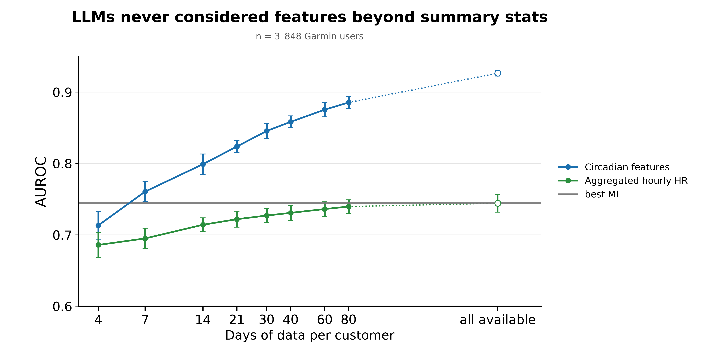

# Days-scaling experiments on the Garmin strict-coverage cohort

## Headline

On the same 3,848 strict-coverage Garmin participants and the same ten
allocations used for v2, sampling *k* adequate days from each user's full
history (mean 425, min 80, p50 476, p90 539, max 979) instead of the first 40
raises single-arm MultiRocket test AUROC from **0.8361** (v2) to **0.8583**
(*k* = 40) to **0.8854** (*k* = 80) to **0.9264** at "all days". That is
**+0.070** over the best v2 representation (Combined MR ⊕ HYDRA, 0.8565) on
matched participants and folds, with frozen α = 1e3, no HYDRA, no
multichannel. MultiRocket is the only arm whose AUROC scales strongly with
budget: Profile24 gains +0.058 and summary RF +0.041 over the same range; MR
gains +0.213.

The budget curve is concave in *k*. On *k* ∈ [4, 80] it fits two functional
forms almost indistinguishably in-range:

- Log-linear: AUROC = *a* + *b* log₂(*k*); test *a* = 0.6450, *b* = 0.0395 per
  doubling, R² = 0.987, RMSE = 0.0064; val R² = 0.992, RMSE = 0.0047.
- LLN-style moment precision: AUROC = *L* − *C*/√*k*; test *L* = 0.9272,
  *C* = 0.4406, RMSE = 0.0060; val *L* = 0.9161, *C* = 0.4120, RMSE = 0.0070.

Per-user extrapolation at the endpoint (mean budget 425, but each user uses
their own pool size *k*ᵤ; prediction averages *L* − *C*/√*k*ᵤ over the 3,848
users) gives 0.9046 (test) and 0.8949 (val). Observed endpoint is 0.9264 /
0.9235 — **+0.022 / +0.029 above the per-user extrapolation**. The 1/√*k*
fit's residuals at *k* = 60, 80 trend positive (test +0.005, +0.007; val
+0.005, +0.009), meaning the true curve is less concave than 1/√*k* at the
high-*k* end. So the moment-precision model is the right *shape* in-range
but its *asymptote* L is a lower bound on the true ceiling; the log-linear
extrapolation at *k* = 425 (0.99) is an upper bound. The endpoint sits
between the two. No fixed-*k* point at *k* > 80 was measured, so the true
ceiling is unobserved.

Three endpoint qualifiers matter for any use of the 0.9264 number:

1. The endpoint is **one kernel draw** (comp seed 6) evaluated under ten
   fold-splits. Its CI (0.0055) is fold-only; a fold-plus-kernel comparable
   SD inferred from *k* = 80 is ~0.011–0.015. The +0.041 jump from *k* = 80
   is far beyond either bound.
2. α = 1e3 is frozen across the whole experiment; per-budget α tuning
   remains a cheap next step on the saved endpoint features, and the
   α = 3e3 − α = 1e3 gap **flips sign** at the endpoint (−0.0085), so the
   reported 0.9264 is a floor on what ridge regression can extract.
3. "All days" is each user's own pool (80–979), not a fixed 425-day budget.
   A static-feature confound control (Profile24 +0.005, summary RF +0.001
   over the same 80 → all transition) shows the coverage/leakage channel
   is small but does not eliminate it.



**Figure.** Test AUROC vs days sampled per participant, full-history pool.
Markers at *k* ∈ {4, 7, 14, 21, 30, 40, 60, 80} with mean over 10 allocations;
error bars are 95% t-CI (df = 9). Open marker at *k* = 425 is the "all days"
endpoint: variable budget (80–979, mean 425), single kernel draw, CI is
fold-split-only. Dashed reference lines: fsplit Garmin (30 repeated 70/15/15
splits, same 3,848-user cohort) — default RF (A0, 534 features) 0.7435 and
feature-selected RF (A3_k50, top-50 by permutation importance) 0.7445. They
overlap (Δ = 0.001), reproducing the fsplit "feature selection buys nothing"
verdict on this cohort.

---

## 1. Design

Three experiments, all on the v2 cohort (3,848 R1b strict-coverage Garmin,
≥ 80 adequate ch3000 days) and v2's ten allocator allocations (70/15/15
train/val/test). MR kernels and all transforms are frozen at v2's protocol;
no HYDRA, no multichannel, no per-*k* kernel refit. Per-arm tests are paired
within allocation.

| | E1 — first-*k*, window | E2 — random-*k*, window | E3 — random-*k*, full pool + endpoint |
|---|---|---|---|
| *k* grid | {4, 7, 14, 21, 30} | {4, 7, 14, 21, 30, 40} | {4, 7, 14, 21, 30, 40, 60, 80} + endpoint (*k* = −1) |
| Days drawn from | user's first *k* adequate days (chronological) | first 40 adequate days, sampled uniformly without replacement | each user's entire adequate pool (mean 425), sampled uniformly without replacement |
| Days per user | exactly *k* | exactly *k* | exactly *k* (fixed-*k*) or 80–979 (endpoint) |
| Cohort selection | unchanged | unchanged | unchanged; 80 = min pool ⇒ no per-*k* cohort selection |
| Day permutation | n/a (chronological) | independent draws per *k* | one nested per-user random permutation per allocation (comp seed 5); *k*-points are prefixes |
| MR kernels | shared across *k* per alloc | shared across *k* per alloc | shared across *k* per alloc (fixed-*k*); single dedicated draw (comp seed 6) for endpoint |
| R allocations | 10 | 10 | 10 (fixed-*k*); 10 fold-splits evaluated at endpoint |
| Script | `day_scaling.py` | `day_scaling_random.py` | `day_scaling_all.py` |
| Wall | 620 s | ~816 s | 1,919 s (~145 s/alloc + 460 s endpoint); scan adds 183 s |
| Peak RSS | 6.5 GiB | ~7.0 GiB | 10.9 GiB — exceeds the v2 8 GiB gate |

**Within-experiment gates.**

- E2 *k* = 40 (identity draw = all 40 designated days) replays v2's
  MultiRocket arm exactly. `days_scaling_random_gate.csv` records
  `auroc_mine == auroc_v2` to all 30 (alloc × arm) cells with
  `max_abs_dtest = max_abs_dval = 0.0` — bit-identical to v2 (tighter than
  v2's own 1–2 ULP verify).
- E3 reuses the v2 cohort and folds; `scan_users == users` and
  `dayall.user == repeat(users, days_per_user)` pass at load.
- Scan: 183 s, 0 errors, 0 zero-mask days, p50 observed bins/day = 283/288.

**Erratum (resolved; archived).** E1 and E2 v1 outputs (`*_v1mrbug.*`)
dropped B40Z from the B40Z ⊕ MRZ concatenation (n_cols = 18,816 vs v2's
19,121). Profile24 and Summary_RF numbers were correct throughout; the
corrected MR levels moved ≤ +0.002 AUROC vs buggy; the *k* = 40 replay gate
against v2 is exact. Buggy outputs are preserved and excluded from this
report.

---

## 2. Results

### 2.1 E3 full pool — test AUROC (mean ± SD over 10 allocations)

| *k* | MR α=1e3 | MR α=3e3 | Profile24 | Summary RF |
|---:|---:|---:|---:|---:|
| 4 | 0.7132 ± 0.0268 | 0.7348 ± 0.0240 | 0.6858 ± 0.0245 | 0.6692 ± 0.0245 |
| 7 | 0.7605 ± 0.0196 | 0.7799 ± 0.0171 | 0.6949 ± 0.0200 | 0.6755 ± 0.0234 |
| 14 | 0.7990 ± 0.0198 | 0.8159 ± 0.0182 | 0.7141 ± 0.0135 | 0.6860 ± 0.0201 |
| 21 | 0.8237 ± 0.0120 | 0.8391 ± 0.0130 | 0.7219 ± 0.0155 | 0.6961 ± 0.0205 |
| 30 | 0.8455 ± 0.0145 | 0.8573 ± 0.0146 | 0.7270 ± 0.0141 | 0.6984 ± 0.0227 |
| 40 | 0.8583 ± 0.0115 | 0.8684 ± 0.0128 | 0.7308 ± 0.0145 | 0.7023 ± 0.0200 |
| 60 | 0.8753 ± 0.0139 | 0.8814 ± 0.0131 | 0.7361 ± 0.0143 | 0.7089 ± 0.0225 |
| 80 | 0.8854 ± 0.0115 | 0.8894 ± 0.0116 | 0.7396 ± 0.0131 | 0.7098 ± 0.0179 |
| **all** | **0.9264 ± 0.0055** | 0.9179 ± 0.0072 | 0.7442 ± 0.0174 | 0.7106 ± 0.0222 |

### 2.2 E3 full pool — val AUROC

| *k* | MR α=1e3 | MR α=3e3 | Profile24 | Summary RF |
|---:|---:|---:|---:|---:|
| 4 | 0.7187 ± 0.0214 | 0.7389 ± 0.0198 | 0.6926 ± 0.0186 | 0.6693 ± 0.0179 |
| 7 | 0.7576 ± 0.0171 | 0.7765 ± 0.0200 | 0.7051 ± 0.0217 | 0.6754 ± 0.0195 |
| 14 | 0.7948 ± 0.0237 | 0.8120 ± 0.0241 | 0.7214 ± 0.0275 | 0.6902 ± 0.0261 |
| 21 | 0.8175 ± 0.0184 | 0.8317 ± 0.0199 | 0.7254 ± 0.0277 | 0.6968 ± 0.0243 |
| 30 | 0.8409 ± 0.0125 | 0.8518 ± 0.0143 | 0.7293 ± 0.0268 | 0.6996 ± 0.0217 |
| 40 | 0.8510 ± 0.0160 | 0.8609 ± 0.0182 | 0.7347 ± 0.0236 | 0.7052 ± 0.0216 |
| 60 | 0.8676 ± 0.0151 | 0.8742 ± 0.0183 | 0.7407 ± 0.0245 | 0.7071 ± 0.0172 |
| 80 | 0.8793 ± 0.0150 | 0.8835 ± 0.0181 | 0.7436 ± 0.0254 | 0.7107 ± 0.0173 |
| **all** | **0.9235 ± 0.0131** | 0.9165 ± 0.0151 | 0.7499 ± 0.0259 | 0.7238 ± 0.0191 |

### 2.3 E1 and E2 (window) — test and val means

| *k* | E1 MR-1e3 | E2 MR-1e3 | E1 MR-3e3 | E2 MR-3e3 | E1 P24 | E2 P24 | E1 RF | E2 RF |
|---:|---:|---:|---:|---:|---:|---:|---:|---:|
| test |  |  |  |  |  |  |  |  |
| 4 | 0.6932 | 0.7144 | 0.7168 | 0.7352 | 0.6930 | 0.6906 | 0.6713 | 0.6762 |
| 7 | 0.7322 | 0.7441 | 0.7535 | 0.7659 | 0.6942 | 0.7050 | 0.6681 | 0.6873 |
| 14 | 0.7750 | 0.7896 | 0.7946 | 0.8070 | 0.7123 | 0.7143 | 0.6944 | 0.6843 |
| 21 | 0.7979 | 0.8043 | 0.8151 | 0.8229 | 0.7210 | 0.7297 | 0.6967 | 0.6949 |
| 30 | 0.8117 | 0.8253 | 0.8281 | 0.8382 | 0.7292 | 0.7294 | 0.7026 | 0.7009 |
| 40 | — | 0.8361 | — | 0.8476 | — | 0.7370 | — | 0.7031 |
| val |  |  |  |  |  |  |  |  |
| 4 | 0.6834 | 0.7043 | 0.7050 | 0.7242 | 0.6852 | 0.6859 | 0.6719 | 0.6659 |
| 7 | 0.7188 | 0.7422 | 0.7400 | 0.7630 | 0.6936 | 0.6948 | 0.6656 | 0.6724 |
| 14 | 0.7770 | 0.7811 | 0.7953 | 0.7989 | 0.7069 | 0.7051 | 0.6860 | 0.6838 |
| 21 | 0.7962 | 0.8034 | 0.8118 | 0.8185 | 0.7123 | 0.7107 | 0.6852 | 0.6925 |
| 30 | 0.8138 | 0.8139 | 0.8261 | 0.8286 | 0.7171 | 0.7215 | 0.6924 | 0.6930 |
| 40 | — | 0.8284 | — | 0.8387 | — | 0.7248 | — | 0.6962 |

---

## 3. Findings

### 3.1 Budget curve (E3): concave, ceiling at least 0.93, unobserved

The MultiRocket α=1e3 marginal gain per day is strongly concave in *k*:

| step | 4→7 | 7→14 | 14→21 | 21→30 | 30→40 | 40→60 | 60→80 | 80→all (+345 d) |
|---|---:|---:|---:|---:|---:|---:|---:|---:|
| ΔAUROC/day (test) | 0.01575 | 0.00550 | 0.00353 | 0.00242 | 0.00128 | 0.00085 | 0.00051 | 0.00012 |
| ΔAUROC/day (val)  | 0.01297 | 0.00531 | 0.00325 | 0.00259 | 0.00102 | 0.00083 | 0.00059 | 0.00013 |
| ΔAUROC/doubling (test) | 0.0585 | 0.0385 | 0.0422 | 0.0424 | 0.0308 | 0.0290 | 0.0245 | — |

Per-doubling gains decline ~58% from *k* = 4 to *k* = 80 (test). A pure
log-linear model would predict constant per-doubling gains; the observed
decline is the in-range signal that the curve is concave.

**Two two-parameter fits on the *k* ∈ [4, 80] segment** (test means):

| model | test | val | test RMSE | val RMSE |
|---|---|---|---:|---:|
| AUROC = *a* + *b* log₂*k* | *a* = 0.6450, *b* = 0.0395/doubling, R² = 0.987, SE(*b*) = 0.0019 | *a* = 0.6512, *b* = 0.0371/doubling, R² = 0.992, SE(*b*) = 0.0014 | 0.0064 | 0.0047 |
| AUROC = *L* − *C*/√*k* | *L* = 0.9272, *C* = 0.4406 | *L* = 0.9161, *C* = 0.4120 | 0.0060 | 0.0070 |

Both fits are statistically adequate on the 8 fixed-*k* points. They diverge
on extrapolation. At each user's own pool size, the 1/√*k* per-user prediction
averages *L* − *C*/√*k*ᵤ over the 3,848 users:

$$\widehat{\text{AUROC}}_{\text{endpoint}} \;=\; L \;-\; C\,\frac{1}{n}\sum_{u=1}^{n}\frac{1}{\sqrt{k_u}} \;=\; 0.9046 \text{ (test)}, \; 0.8949 \text{ (val)};$$

the log-linear per-user prediction averages *a* + *b* log₂ *k*ᵤ:

$$\widehat{\text{AUROC}}_{\text{endpoint}} \;=\; a \;+\; b\,\frac{1}{n}\sum_{u=1}^{n}\log_2 k_u \;=\; 0.9860 \text{ (test)}, \; 0.9719 \text{ (val)}.$$

The observed endpoint (0.9264 test, 0.9235 val) sits **0.022 / 0.029 above
the 1/√*k* per-user prediction and 0.060 / 0.048 below the log-linear
per-user prediction.** So the true curve flattens (log-linear is the wrong
shape beyond *k* = 80) but flattens less than 1/√*k* predicts (the 1/√*k*
ceiling L is a lower bound).

A second piece of evidence: the 1/√*k* residuals at the top of the
in-range segment trend positive — *k* = 60: +0.0049 / +0.0047;
*k* = 80: +0.0074 / +0.0093 (test / val). A curve that is *less* concave
than 1/√*k* at high *k* will have a higher true ceiling than the fitted L.
Conversely, the log-linear fit's residuals trend negative at the same
points (*k* = 60: −0.0031 / −0.0031; *k* = 80: −0.0093 / −0.0068),
confirming that pure log-linear is too aggressive.

**Honest summary.** On this cohort and folds, MultiRocket budget scaling
fits a concave increasing curve whose in-range behavior is consistent with
moment-pooling precision (1/√*k*) and whose extrapolation lies between
*L* = 0.927 (test; lower bound on ceiling) and 0.99 (log-linear; upper
bound). The endpoint at 0.9264 is consistent with the curve still rising
or having just reached a plateau near 0.93. No fixed-*k* measurement
above *k* = 80 was taken, so the true ceiling is unobserved.

For Profile24 and summary RF the per-day marginals are far smaller and the
total gain from *k* = 4 to "all days" is +0.058 (P24: 0.6858 → 0.7442) and
+0.041 (RF: 0.6692 → 0.7106) — about a quarter to a fifth of the
MultiRocket gain in absolute terms. The cheap arms are already near their
ceiling (the fsplit RF references, §3.7) at *k* = 4.

### 3.2 Pool effect at matched *k* (E3 − E2, paired, test)

Days drawn from the full adequate history vs the first-40-day window, same
allocation seeds, same folds. The arm-level deltas isolate whether *which
days* are sampled matters at fixed budget:

| arm | *k* = 4 | *k* = 7 | *k* = 14 | *k* = 21 | *k* = 30 | *k* = 40 |
|---|---:|---:|---:|---:|---:|---:|
| MR α=1e3 (test) | −0.0011 [−0.026, +0.024] | **+0.0164** [+0.000, +0.033] | +0.0094 [−0.008, +0.026] | **+0.0194** [+0.008, +0.031] | **+0.0202** [+0.007, +0.033] | **+0.0222** [+0.011, +0.034] |
| MR α=1e3 (val)  | +0.0144 [−0.008, +0.037] | **+0.0154** [+0.001, +0.029] | +0.0136 [−0.003, +0.030] | **+0.0142** [+0.003, +0.025] | **+0.0269** [+0.013, +0.041] | **+0.0226** [+0.011, +0.034] |
| Profile24 (test) | −0.0047 [−0.013, +0.004] | **−0.0100** [−0.019, −0.001] | −0.0002 | −0.0078 [−0.017, +0.002] | −0.0024 | −0.0062 |
| Summary_RF (test) | −0.0069 | −0.0117 [−0.025, +0.002] | +0.0017 | +0.0012 | −0.0025 | −0.0008 |

MultiRocket is the only arm with a consistent positive pool effect at
*k* ≥ 7 (~+0.02 on test, +0.02 on val). At *k* = 4 the test pool effect
is essentially zero and the val pool effect is positive but the CI
straddles zero — pool diversity only helps once enough days exist for the
moments to use it. Profile24 trends slightly negative (small *k*): the
hour-of-day profiles are roughly position-invariant, so swapping which
days enter at the same *k* just adds noise. Summary_RF is flat.

**Protocol-difference caveat.** E3 and E2 also differ in the kernel-fit
window: E2 fits MR on `fit_days` chosen from the first-40-day window
(`K_MAX = 40`), E3 from a permuted 80-day window (`K_MAX = 80`). Both use
`comp_seed(r, COMP_DAY_SELECT)` so the kernel draws are different but
identically seeded. The +0.022 matched-*k* pool effect thus bundles two
things: (a) sampling-day diversity, and (b) a kernel fit on a larger and
more varied day set. The latter is a real methodological improvement, not
a confound; the magnitude is not separately identified.

### 3.3 Position effect within the window (E2 − E1, paired)

E1 (chronological first-*k*) vs E2 (uniform random *k* from the first-40
window). **MR kernels are identical between E1 and E2 within allocation**:
both scripts use `comp_seed(r, COMP_DAY_SELECT)` with the same fit window
(verified in source). The only difference is which *k* days enter the
pooling. This makes E2 − E1 a clean position effect.

| *k* | MR α=1e3 test | MR α=1e3 val |
|---:|---:|---:|
| 4 | **+0.0212** [+0.005, +0.037] | **+0.0208** [+0.001, +0.041] |
| 7 | +0.0119 [−0.002, +0.026] | **+0.0234** [+0.003, +0.044] |
| 14 | +0.0145 [+0.000, +0.029] | +0.0041 [−0.011, +0.020] |
| 21 | +0.0064 [−0.004, +0.017] | **+0.0072** [+0.001, +0.014] |
| 30 | +0.0136 [+0.000, +0.027] | +0.0001 [−0.011, +0.011] |

Effect is most clearly MR-specific at *k* = 4: both test and val deltas are
significant for MR (+0.021 each), while P24 and RF CIs straddle zero on both
metrics. At *k* = 7 the test deltas for P24 (+0.011 [+0.001, +0.021]) and
RF (+0.019 [+0.006, +0.033]) become significant while MR's (+0.012 [−0.002,
+0.026]) does not, so the position effect at *k* = 7 is not MR-specific.
At *k* ≥ 14 only MR trends positive on both metrics; the few P24/RF
marginal cells (P24 *k* = 21 test +0.009 [+0.000, +0.017]; RF *k* = 21 val
+0.007 [+0.001, +0.014]) are close to the significance threshold and not
robust across *k*.

Averaged across *k* ∈ {4, …, 30}, MR test deltas sum to +0.0676 (mean
+0.0135), P24 to +0.0192 (mean +0.0038), RF to +0.0104 (mean +0.0021).
So at matched *k* within a fixed 40-day window, drawing uniformly random
days beats drawing the first chronologically by ~+0.01–+0.02 for the
transform and by ~+0.003 on average for the cheap arms — present in the
same direction everywhere but ~3–6× larger for MR.

### 3.4 α × budget: the optimal penalty flips at the endpoint

α = 3e3 minus α = 1e3 (E3, paired):

| *k* | 4 | 7 | 14 | 21 | 30 | 40 | 60 | 80 | all |
|---|---:|---:|---:|---:|---:|---:|---:|---:|---:|
| test | +0.0216 | +0.0194 | +0.0169 | +0.0154 | +0.0118 | +0.0101 | +0.0062 | +0.0040 | **−0.0085** |
| val  | +0.0202 | +0.0189 | +0.0173 | +0.0142 | +0.0109 | +0.0098 | +0.0066 | +0.0042 | **−0.0071** |

The sign of the 3e3 − 1e3 gap changes between *k* = 80 and the endpoint.
This is the standard bias-variance trade under Ridge regression: pooled
features gain precision ∝ 1/√*k* (their sampling variance shrinks with the
day budget), so the variance term in the prediction-error decomposition
falls with *k* and the optimal α generally decreases. With α frozen at
1e3 throughout (3e3 only as a sensitivity column), the endpoint 0.9264
is a **floor** — a per-budget α sweep would shift the curve upward on
both ends.

### 3.5 Representation gap widens monotonically with budget

MR α=1e3 − Profile24 (E3, test):

| *k* | 4 | 7 | 14 | 21 | 30 | 40 | 60 | 80 | all |
|---|---:|---:|---:|---:|---:|---:|---:|---:|---:|
| Δ | +0.0274 | +0.0656 | +0.0849 | +0.1018 | +0.1185 | +0.1275 | +0.1392 | +0.1458 | **+0.1822** |

Grows monotonically from +0.027 at *k* = 4 to +0.182 at the endpoint
(~6.7×). The CIs at *k* ≥ 7 are tight — the gap is not noise. Each new
day contributes more independent convolution responses to the moment
estimates for the transform arm than to the 48 P24 hour-profile columns,
which saturate quickly.

### 3.6 Endpoint design and confound controls

The endpoint (k = −1) differs from the fixed-*k* points in three ways:

1. **Variable budget.** Each user's own pool (80–979, mean 425; p10 225,
   p50 476, p90 539) instead of a fixed *k*. Pool size correlates with
   engagement and plausibly with the label, so a fraction of the +0.041
   jump from *k* = 80 could ride on a coverage-frequency feature in the
   B40 statics.
2. **Single kernel draw.** One dedicated draw (comp seed 6), fit on 4
   seeded days from alloc-0 train users' full pools; evaluated under all
   ten fold-splits. Endpoint SD = 0.0055 fold-only; a fold-plus-kernel
   comparable SD inferred from the *k* = 80 SD of 0.0115 would be ~0.011–
   0.015. Either way the +0.041 jump is far beyond noise.
3. **Static-feature confound control.** The 80 → all-days deltas, on arms
   that share the same B40 statics:

   | arm | k=80 → all (test) | k=80 → all (val) |
   |---|---:|---:|
   | MultiRocket α=1e3 | **+0.0410** [+0.033, +0.049] | +0.0442 [+0.037, +0.052] |
   | MultiRocket α=3e3 | +0.0285 [+0.021, +0.036] | +0.0329 [+0.026, +0.039] |
   | Profile24 | +0.0046 [−0.001, +0.011] | +0.0062 [+0.001, +0.011] |
   | Summary_RF | +0.0008 [−0.011, +0.012] | +0.0132 [+0.002, +0.024] |

   If the endpoint gain were driven by a coverage/leakage feature in B40
   that depends on pool size, Profile24 and RF would gain too. They don't
   (≤ +0.013 across both metrics, vs +0.041 / +0.044 for MultiRocket).
   The bulk of the endpoint gain is transform-specific pooling precision.

The +0.022 / +0.029 gap between observed endpoint and the 1/√*k*
per-user extrapolation (§3.1) is **not** bounded by this control and could
plausibly include:
(i) a kernel fit on more diverse full-pool days (different seed, not
controlled by the P24/RF arms which have no kernels);
(ii) per-user feature precision that is itself user-dependent — users with
larger pools have more precisely estimated moments, and this heterogeneity
interacts with whatever the classifier extracts;
(iii) genuine model misfit of the 1/√*k* functional form at *k* > 80, as
signalled by the trending-positive in-range residuals.

### 3.7 References on the same cohort

**fsplit Garmin** (30 repeated 70/15/15 splits, source 3, same 3,848 users):

- Default RF (A0, 534 features): test AUROC **0.7435 ± 0.0172**.
- Feature-selected RF (A3_k50, top-50 by permutation importance on val):
  test AUROC **0.7445 ± 0.0165**.

Δ = 0.001 — fsplit's own conclusion that feature selection buys nothing on
this cohort. Profile24 at the full-history endpoint (0.7442) sits between
these two references (gap ≤ 0.0007 from each), so hour-profile ridge
reaches the same ceiling as a default-config RF on the same feature matrix.

**v2 frozen ladder** (same cohort, first-40-day window, 10 allocations):

| arm | test AUROC | source |
|---|---:|---|
| Combined (MR ⊕ HYDRA) | 0.8565 ± 0.0146 | `temporal_metrics.csv` |
| HYDRA | 0.8442 ± 0.0113 | v2 |
| MultiRocket | 0.8361 ± 0.0149 | v2 (= E2 *k* = 40 anchor) |
| Summary linear | 0.7157 ± 0.0204 | v2 |
| Summary RF | 0.7031 ± 0.0192 | v2 (= E2 *k* = 40 anchor) |

E3 *k* = 40 already matches Combined v2 (0.8583 vs 0.8565); E3 endpoint
0.9264 single-arm beats the entire v2 ladder by **+0.070**.

---

## 4. What this does and doesn't show

**Established on this cohort and folds.** Sampling days from the user's
full adequate history beats sampling from the first-40-day window for the
transform arm; the budget curve for MultiRocket fits both log-linear and
1/√*k* moment-precision models indistinguishably in-range (R² 0.987 and
RMSE 0.006); the per-user extrapolation places the curve between the two
models' predictions (above 1/√*k*, below log-linear) and is consistent with
a ceiling at or above 0.93. The cheap arms (Profile24, summary RF) do not
benefit materially from budget — they sit near the fsplit RF ceiling at
every *k* ≥ 4. The +0.041 jump from *k* = 80 to the endpoint is
transform-specific (P24 and RF gain ≤ +0.013 over the same range).

**Not established.** Whether the true ceiling is 0.93 or higher — no
fixed-*k* measurement above 80 was taken; both extrapolation models have
~±0.01 model error on the in-range segment. Whether per-budget α tuning
raises the curve uniformly. Whether the same gain reproduces on a less
selected cohort (export median ≈ 40 adequate days is not covered here).

**Endpoint design choices that move the number.** α (frozen at 1e3; the
3e3 − 1e3 gap flips sign at the endpoint, so the reported 0.9264 is a
floor); kernel set (single draw, fold-split-only CI; one of many possible
draws); variable budget (engagement/pool-size signal not fully bounded by
the P24/RF control); absence of fixed-*k* points above 80.

**Specific qualifiers.**
1. **Endpoint single kernel draw.** CI = 0.0055 fold-only; fold-plus-kernel
   SD inferred from *k* = 80 is ~0.011–0.015. The +0.041 jump from *k* = 80
   is far beyond either bound.
2. **Endpoint budget heterogeneity.** Confound control (P24 +0.005, RF
   +0.001) indicates the static-feature coverage channel is small but does
   not eliminate it.
3. **α frozen.** 0.9264 is a floor; per-budget α tuning on the saved
   endpoint features is the cheapest open improvement.
4. **Cohort gate.** ≥ 80 adequate days, mean 425. The curve speaks for the
   long-history Garmin stratum; export median (~40 adequate days) is not
   covered.
5. **RSS deviation.** E3 peak RSS = 10.9 GiB exceeds the v2 8 GiB gate
   (dayall table + pooled slabs in RAM; memmap keeps the 1.9 GB hr /
   0.5 GB mask arrays out of RSS but the page cache plus the in-memory
   slabs reach 10.9 GiB). No failure, no swap. E1 and E2 stayed within
   gate.
6. **Cross-split endpoint kernels.** The endpoint kernels are fit on
   alloc-0 train users' full-pool days (comp seed 6) and evaluated under
   all 10 fold-splits — mild unsupervised cross-split exposure of val/
   test days to bias quantiles. Same class of exposure as the per-alloc
   v2 fill/fit protocol; documented.

---

## 5. Methods

### 5.1 Cohort, folds, bins

Same as v2: 3,848 R1b strict-coverage Garmin participants
(`experiments/r1b_dateaware_garmin_2026-09-21/cache/dayall_table.parquet`),
≥ 80 adequate ch3000 days per participant. Per day, 288 × 5-min local-clock
bins of event-mean HR, source = 3, ch = 3000, NaN-tz rejection, HR ∈
[25, 230], `EXCLUDED_SOURCES` filtered. The same 10 allocator allocations
(70/15/15 train/val/test) used for v2 are reused; per-arm tests are paired
within allocation. Cohort distribution of adequate-day counts: min 80,
p10 225, mean 425, p50 476, p90 539, max 979 (n = 3,848).

### 5.2 MultiRocket (vendored)

84 fixed kernels: all C(9,3) = 84 weight patterns on the 9-point dilated
kernel, weights −1 on one dilated tap and +3 on three others. Per kernel,
*b* = ⌊1250 / 84⌋ = 14 bias channels; biases are quantiles of the
convolved training output, numba-internal RNG (`_nb_seed` shim before each
`mr_fit` is mandatory for reproducibility — v2 REPORT §8 erratum).
Dilations are base-2 log-spaced from 1 to ~128, folded into the 14 bias
slots. Four feature types per (kernel, dilation, bias) channel: PPV
(proportion above bias), LSPV (longest stretch below bias), MPV (mean of
above-bias values), mean-activation index (mean index of above-bias
activations, −1 if PPV = 0).

Day-level features per transform:

$$84 \times 14 \times 4 \;=\; 4{,}704.$$

Two transforms — the level series *X* and the first difference *X*1 — each
fitted independently, so per-day F_d ∈ ℝ^9408.

### 5.3 User-level pooling

For each user with observed-day indicator *o*<sub>*d*</sub> ∈ {0, 1}:

$$\hat\mu_j \;=\; \frac{1}{\sum_d o_d}\sum_{d=1}^{k} o_d F_{d,j}, \qquad \hat\sigma_j^{\,2} \;=\; \frac{1}{\sum_d o_d - 1}\sum_{d=1}^{k} o_d \bigl(F_{d,j} - \hat\mu_j\bigr)^2.$$

The user-level MRZ block is [$\hat\mu$, $\hat\sigma$] ∈ ℝ^18,816. Profile24
is mean + ddof-1 SD over the 24 `hour_h{h}` columns of the same days
(48 cols). B40 (305 cols raw) is mean + SD of 8 daily ch3000 stats
(`d_ch3000_{mean, median, sd, vmin, vmax, n, cov_h, hours}`), per-bin
`mask_K[:, :k, :].mean(axis=1)` (288 mask observation frequencies), and
`weekday_mean − weekend_mean` of daily mean HR (NaN when the *k* sampled
days contain no weekend day; imputed by `hygiene_std`).

### 5.4 Hygiene per block

`SimpleImputer(strategy="median")` → `VarianceThreshold(0.0)` →
`StandardScaler`. All three fitted on train rows of the allocation, applied
unchanged to val/test. The MRZ block is constant-size 18,816 columns (0
columns dropped by VT in every run). The B40Z block is 305 columns raw;
VT drops per-bin mask_means columns whose train-fold variance is below the
threshold, so post-VT B40Z contributes 275–305 columns depending on
allocation and *k*. Total concatenation *n*_cols varies in
**19,091–19,121** across the (alloc, *k*) grid.

### 5.5 E3 fixed-*k* loop

For each of the 10 allocations:

1. **Nested permutation.** `perm_rng = default_rng(comp_seed(r, COMP_PERM))`.
   Per user, sample `argsort(rng.random(days_per_user[u]))[:80]` — a uniform
   random ordering of the user's adequate days truncated at 80.
2. **Prefix structure.** The fixed-*k* curve reuses these prefixes: every
   *k* ∈ {4, …, 80} is a prefix of the same per-user random order. **K-points
   within an allocation share kernel noise and permutation noise** — the
   budget axis is isolated on a fixed random day sequence.
3. **MR fit per allocation.** `fit_rng = default_rng(comp_seed(r, COMP_DAY_SELECT))`,
   `fit_days = stack([choice(80, 4, replace=False) for _ in range(n_tr)])`,
   `X_fit = hr_filled_K[tr[:, None], fit_days]` → `mr_fit(X_fit)` and
   `mr_fit(np.diff(X_fit, axis=1))`.
4. **Transform.** First 80 sampled days per user, chunked over 256 users:
   `X.reshape(sz × 80, 288) float64`, `X1 = diff(X, axis=1)`,
   `mr_transform(X, X1, params_base, params_diff, 4)`. Pool **prefixes**
   by $\hat\mu$ and $\hat\sigma$ into `pooled_mean[:, ki, :]`,
   `pooled_sd[:, ki, :]`.
5. **Statics per *k*.** Groupby mean/SD over
   `dayall.iloc[(starts[:, None] + perm[:, :k]).ravel()]`; mask block from
   `mask_K[:, :k, :].mean(axis=1)`.
6. **Fit four arms.** MR primary α=1e3, MR sens α=3e3, P24 α=1e3, RF G1
   @ 100 trees on train rows of the fold.

### 5.6 E3 endpoint (Phase B)

- **Single MR fit.** Comp seed 6, fit on 4 seeded days from alloc-0 train
  users' full pools (`efit_rng = default_rng(comp_seed(0, COMP_ENDPOINT))`,
  `efit_days = stack([choice(int(dpu[u]), 4, replace=False) for u in tr])`).
- **Per-user full-pool transform** (sequential; ~0.1 s/user), pool
  $\hat\mu$/$\hat\sigma$.
- **Full-pool statics.** Groupby over 1.64M dayall rows; mask_means looped
  over users from memmap.
- **Evaluate under all 10 fold-splits.** Hygiene + ridge + RF refit per
  split, no kernel refit.

### 5.7 E1 / E2 (window)

E2 mirrors E3 with `K_MAX = 40` and *k* ∈ {4, 7, 14, 21, 30, 40} over the
first-40 adequate-day window; E1 uses chronological first-*k* without the
permutation. E2 includes the *k* = 40 identity gate against v2.

### 5.8 Component seeds

`comp_seed(r, c) = SeedSequence([SEED_BASE = 20260921, r, c]).spawn(1)[0]`.
Existing v2 component IDs reused (`COMP_DAY_SELECT` = 0 etc.); COMP_PERM
= 5 (nested per-user permutation, E3) and COMP_ENDPOINT = 6 (endpoint
kernels, E3 Phase B) are new.

### 5.9 Scan (`scan_bins_all.py`)

Re-reads the same 3,848 epoch files as v2 but bins **all 1.64M adequate
user/date pairs** (vs v2's 153,920 first-40-day pairs). 4 workers (v2 used
2). Outputs uncompressed `.npy` for downstream memmap: `hr_all.npy`
(1.64M, 288) float32, `mask_all.npy` (1.64M, 288) bool, `user_all.npy`,
`date_all.npy`, `days_per_user.npy`, `user_ids.npy`, `starts.npy`. `cnt` is
not stored (not a model input). Scan: 183 s, 0 errors, 0 zero-mask days,
p50 observed bins/day = 283/288.

---

## 6. Files

```
experiments/temporal_garmin/
├── day_scaling.py                       # E1 (first-k, window) — corrected
├── day_scaling_random.py                # E2 (random-k, window) — corrected, k=40 v2-replay gate
├── day_scaling_all.py                   # E3 (random-k, full pool) + endpoint
├── scan_bins_all.py                     # full-history 288-bin scan, 4 workers
├── plot_days_scaling.py                 # figure + aggregates
├── results/
│   ├── days_scaling_metrics.csv         # E1
│   ├── days_scaling_random_metrics.csv  # E2
│   ├── days_scaling_random_gate.csv     # E2 k=40 v2-replay gate (Δ = 0.0)
│   ├── days_scaling_all_metrics.csv     # E3 (k = −1 ⇒ endpoint)
│   ├── days_scaling.md                  # E1 standalone report
│   ├── days_scaling_random.md           # E2 standalone report
│   ├── days_scaling_all.md              # E3 standalone report
│   ├── days_scaling_curves.png          # figure (this report)
│   ├── days_scaling_curves.pdf          # figure (this report)
│   ├── DAYS_SCALING_REPORT.md           # this report
│   ├── temporal_metrics.csv             # v2 frozen ladder (anchor)
│   └── *_v1mrbug.*                      # E1/E2 buggy outputs (archived)
├── cache/
│   ├── bins_all/                        # memmap full-history bins
│   │   ├── hr_all.npy, mask_all.npy
│   │   ├── user_all.npy, date_all.npy
│   │   ├── days_per_user.npy, user_ids.npy, starts.npy
│   ├── scan_all_stdout.log              # scan log
│   ├── day_scaling_all_stdout.log       # E3 run log
│   └── plot_stdout.log                  # figure + aggregates log

experiments/artifacts_sq/fsplit/
├── feat_sel_report.md                   # fsplit Garmin (s3) reference (A0=0.7435, A3_k50=0.7445)
├── fsplit_metrics.csv                   # raw per-repeat AUROC
```
